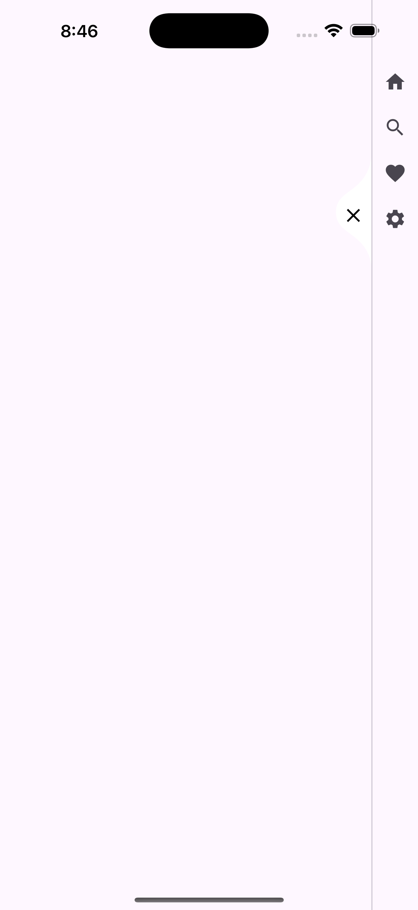

# Dynamic Rail

A Flutter package that provides a customizable and animated side rail widget. This widget can be used to create a dynamic and interactive side navigation rail in your Flutter applications.



    

## Features

- Customizable side rail with animation
- Supports custom icons and child widgets
- Gesture detection for user interactions
- Easy to integrate and use

## Getting Started

To begin using the dynamic_rail package in your Flutter project, add it to your pubspec.yaml file:

```yaml
dependencies:
  dynamic_rail: ^0.0.2+1
```

Then, import the package in your Dart file:

```dart
import 'package:dynamic_rail/dynamic_rail.dart';
```

## Usage

To integrate the DynamicRail widget into your Flutter application, follow the example below:

```dart
bool isRailOpen = false;
```

```Flutter
DynamicRail(
  isRailOpen: isRailOpen,
  icon: Icon(
    isRailOpen ? Icons.close : Icons.menu,
    color: Colors.black,
  ),
  railWidth: 45,
  onPress: () {
    setState(() {
      isRailOpen = !isRailOpen;
    });
  },
  child: Column(
    children: [
      IconButton(
        icon: Icon(Icons.home),
        onPressed: () {
          setState(() {
            // Toggle the rail open state
          });
        },
      ),
      IconButton(
        icon: Icon(Icons.search),
        onPressed: () {
          setState(() {
            // Toggle the rail open state
          });
        },
      ),
      IconButton(
        icon: Icon(Icons.favorite),
        onPressed: () {
          setState(() {
            // Toggle the rail open state
          });
        },
      ),
      IconButton(
        icon: Icon(Icons.settings),
        onPressed: () {
          setState(() {
            // Toggle the rail open state
          });
        },
      ),
    ],
  ),
)
```